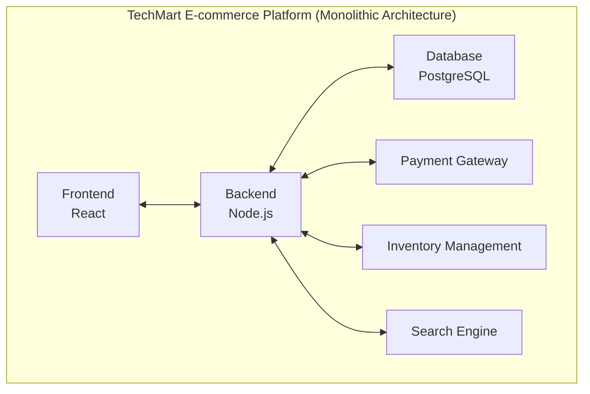

## EXECUTIVE SUMMARY

The current system is facing critical performance and scalability challenges across the database, application, and infrastructure layers. Key findings include a dramatic increase in average database query time (from 50ms to 500ms), frequent maxing out of the connection pool, and missing indexes on high-traffic queries—all contributing to significant backend delays. Application performance has also degraded, with page load times rising from 2 seconds to 8 seconds during peak hours and API response times spiking to 2 seconds. The infrastructure is constrained by a single EC2 instance (t3.xlarge), lacks caching mechanisms such as Redis or a CDN, and has limited observability due to minimal monitoring. These bottlenecks are severely impacting user experience, increasing system resource consumption (RAM at 80% and CPU at 90%), and pose a risk to business continuity as traffic and data volume continue to grow. Immediate optimization and scaling measures are required to restore system reliability and support ongoing business operations.

TechMart Inc., a rapidly growing e-commerce platform, is experiencing significant performance degradation due to a 3× increase in user activity over the past six months. Key performance bottlenecks include database query latency, application resource exhaustion, and a non-scalable infrastructure. These issues have led to a 20% revenue loss, a 35% cart abandonment rate, and rising customer dissatisfaction. The platform’s current monolithic architecture, single-server deployment, and lack of caching or auto-scaling mechanisms are insufficient to meet the new scale of operations.

## CURRENT SYSTEM ANALYSIS
### Architecture Overview
TechMart operates a monolithic architecture hosted on a single AWS EC2 instance (t3.xlarge). It includes:
- **Frontend**: React 18, served as static files from EC2.
- **Backend**: Node.js 18 with Express.js, exposing REST APIs.
- **Database**: PostgreSQL 14 hosted on the same EC2 instance.
- **Supporting Services**: Payment gateway, inventory, and search are directly integrated into the backend.

### Database Bottlenecks
- **Response Time**: Average query time increased from 50ms to 500ms
- **Connection Pool**: Maxed out at 100 concurrent connections
- **Index Issues**: Missing indexes on frequently queried fields
- **Data Growth**: Database size increased from 10GB to 50GB in 6 months

### Application Performance Bottlenecks
- **Page Load Time**: Increased from 2s to 8s during peak hours
- **API Response Time**: Average response time increased from 200ms to 2s
- **Memory Usage**: Application consuming 8GB RAM (80% of server capacity)
- **CPU Usage**: Consistently at 90% during business hours
- **Memory leaks** suspected in long-running processes

### Infrastructure Constraints
- **Single Server**: All services running on one EC2 instance (t3.xlarge)
- **No Caching**: No Redis or CDN implementation
- **Limited Monitoring**: Basic CloudWatch metrics only
- **No Auto-scaling**: Manual scaling required

### Root Cause Analysis
- **Monolithic design** prevents independent scaling of services
- **No caching** forces repeated database hits for every request
- **Single instance deployment** leads to resource contention and service crashes during spikes
- **Lack of observability** makes performance issues hard to diagnose and mitigate proactively

### Impact Assessment
#### Business Impact
- **Cart Abandonment**: Increased from 15% to 35%
- **Page Bounce Rate**: Increased from 20% to 45%
- **Customer Complaints**: 50+ daily complaints about slow performance
- **Revenue Impact**: Estimated 20% revenue loss due to performance issues

#### Technical Impact
- **Server** instability during peak hours
- **Downtime risks** due to lack of redundancy
- **Poor scalability** ahead of holiday season traffic surge (projected 5× load)

## DATA ANALYSIS
### Current Metrics
- **Page Load Time**: 8 seconds (peak), target < 3 seconds
- **API Response Time**: 2 seconds avg., target < 500ms
- **DB Query Time**: 500ms avg., target < 100ms
- **Availability**: Below 99.5%, target 99.9%

### Traffic Patterns
- **Daily Active Users**: 10K → 30K (3× increase)
- **Peak Concurrent Users**: 500 → 1,500
- **Transactions per Second**: 50 → 150
- **Data Transfer**: 1TB → 3TB monthly
  
### Resource Utilization
- **EC2 CPU**: 90%+ usage during business hours
- **RAM**: 8GB usage, 80%+ utilization
- **PostgreSQL connections** at full capacity (100 connections)
- **Disk I/O contention** during order processing and search operations

### Error Rates
- **Increased 500 errors** during peak hours.
- **Timeout** rates above 3% on key endpoints (checkout, search)

### Business Metrics
- Estimated $250K monthly revenue loss
- Customer satisfaction score dropped below 3.8/5
- Over 50 daily support complaints related to speed or failed transactions

## RECOMMENDATIONS
### Immediate Actions
#### Database Optimization:
- Add indexes to frequently queried fields
- Enable connection pooling with PgBouncer or similar

#### Implement Caching:
- Introduce Redis for session, product, and cart caching
- Deploy a CDN (e.g., CloudFront) for static assets

#### Infrastructure Split:
- Move the database to a dedicated RDS instance
- Separate backend and frontend deployments

### Long-term Strategy
#### Microservices Migration:
- Decompose monolith into services (auth, catalog, cart, checkout)
- Use containers (Docker + ECS/EKS) for independent scaling

#### Horizontal Scaling:
- Use auto-scaling groups and load balancers

#### Observability Upgrade:
- Implement centralized logging (e.g., ELK or CloudWatch Logs)
- Add APM tools like New Relic or Datadog

#### Database Enhancements:
- Set up read replicas for scaling reads
- Archive historical data to reduce table size
  
### Priority Ranking
- Add caching (Redis, CDN)
- Optimize PostgreSQL performance
- Split infrastructure (dedicated DB, separate frontend/backend)
- Implement monitoring and observability
- Begin service decomposition and containerization

### Success Criteria
#### Technical:
- Page load time < 3s, API response time < 500ms
- < 0.1% error rate, 99.9% uptime
- CPU < 70%, Memory < 80% utilization

#### Business:
- Cart abandonment < 20%, bounce rate < 25%
- Customer rating > 4.5/5
- 100% recovery of lost revenue
- < 10 daily support complaints
